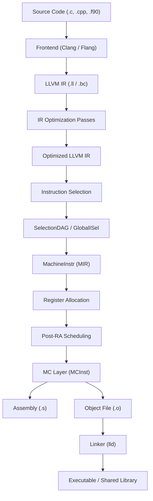

# LLVM Data Flow — How Data Moves Through the System

This document traces how source code is transformed into machine code as it flows through the LLVM compilation pipeline.

---

## The Big Picture



---

## Stage 1: Frontend → LLVM IR

**Entry:** Clang's `CodeGen` module (`clang/lib/CodeGen/`)

The frontend performs parsing, semantic analysis, and AST construction entirely in its own domain. The final step is **IR emission**: walking the AST and producing LLVM IR.

Key data structures at this boundary:
- `llvm::Module` — the top-level IR container. One Module per translation unit.
- `llvm::Function` — one per source-level function.
- `llvm::IRBuilder` — the primary API for constructing IR instructions.

The IR produced at this stage is **unoptimized**. It contains `alloca` instructions for every local variable, no SSA promotion, naive control flow, and no inlining.

**Files:**
- `clang/lib/CodeGen/CodeGenModule.cpp` — module-level IR generation
- `clang/lib/CodeGen/CodeGenFunction.cpp` — function-level IR generation
- `llvm/include/llvm/IR/IRBuilder.h` — the IR construction API

---

## Stage 2: IR Optimization Pipeline

**Entry:** `opt` tool (`llvm/tools/opt/opt.cpp`) or `PassBuilder::buildPerModuleDefaultPipeline()`

The optimizer runs a sequence of **analysis and transformation passes** on the IR. The New Pass Manager (`llvm/include/llvm/Passes/PassBuilder.h`) constructs the pipeline.

### Pass Execution Order (simplified O2 pipeline)

```
Module Pipeline:
├── ForceFunctionAttrsPass
├── InferFunctionAttrsPass
├── CGSCC Pipeline (over call graph SCCs):
│   ├── InlinerPass
│   ├── Function Pipeline (per function):
│   │   ├── SROA (Scalar Replacement of Aggregates)
│   │   ├── EarlyCSE (Common Subexpression Elimination)
│   │   ├── SimplifyCFG
│   │   ├── InstCombine
│   │   ├── JumpThreading
│   │   ├── CorrelatedValuePropagation
│   │   ├── Loop Pipeline:
│   │   │   ├── LICM (Loop Invariant Code Motion)
│   │   │   ├── LoopRotate
│   │   │   ├── IndVarSimplify
│   │   │   ├── LoopDeletion
│   │   │   └── LoopUnroll
│   │   ├── GVN (Global Value Numbering)
│   │   ├── MemCpyOpt
│   │   ├── DSE (Dead Store Elimination)
│   │   ├── ADCE (Aggressive Dead Code Elimination)
│   │   └── SimplifyCFG
│   └── ...
├── GlobalDCE (Dead Global Elimination)
├── ConstantMerge
└── ...
```

### Data Flow Within a Pass

Each pass:
1. **Requests analyses** it depends on (e.g., `DominatorTree`, `LoopInfo`, `AliasAnalysis`)
2. The Pass Manager lazily computes and caches analyses
3. The pass **reads** the IR and analysis results
4. The pass **transforms** the IR (adding/removing/modifying instructions)
5. The pass **reports** which analyses it invalidated
6. The Pass Manager invalidates stale analysis caches

**Key insight:** The IR is modified **in-place**. There is no copying between passes. The `Module`, `Function`, `BasicBlock`, and `Instruction` objects are mutable and shared across the entire pipeline.

**Files:**
- `llvm/lib/Passes/PassBuilder.cpp` — pipeline construction
- `llvm/lib/Passes/PassBuilderPipelines.cpp` — predefined pipeline definitions
- `llvm/include/llvm/IR/PassManager.h` — pass manager infrastructure

---

## Stage 3: Instruction Selection (IR → MachineInstr)

**Entry:** `llc` tool (`llvm/tools/llc/llc.cpp`) or `TargetMachine::addPassesToEmitFile()`

This is where target-independent LLVM IR meets the target-specific world. Two instruction selection frameworks exist:

### SelectionDAG (legacy, but still dominant)

```
LLVM IR → SelectionDAG (DAG of target-independent nodes)
       → Legalization (make types/operations legal for target)
       → DAG Combine (peephole optimizations on DAG)
       → Instruction Selection (pattern match → target instructions)
       → Scheduling (linearize DAG into MachineInstr sequence)
```

The SelectionDAG operates one **basic block at a time**. Each IR basic block is converted to a DAG, optimized, selected, and scheduled independently.

**Files:**
- `llvm/lib/CodeGen/SelectionDAG/SelectionDAGISel.cpp` — the selection loop
- `llvm/lib/CodeGen/SelectionDAG/SelectionDAGBuilder.cpp` — IR → DAG translation
- `llvm/lib/CodeGen/SelectionDAG/LegalizeDAG.cpp` — type/operation legalization

### GlobalISel (newer, gradually replacing SelectionDAG)

```
LLVM IR → Generic MachineInstr (target-independent opcodes, virtual registers)
       → IRTranslator (IR → Generic MI)
       → Legalizer (make operations legal)
       → RegBankSelect (assign register banks)
       → InstructionSelect (select target instructions)
```

GlobalISel operates on MachineInstr directly (no intermediate DAG), supports cross-basic-block analysis, and is generally faster to compile.

**Files:**
- `llvm/lib/CodeGen/GlobalISel/IRTranslator.cpp`
- `llvm/lib/CodeGen/GlobalISel/Legalizer.cpp`
- `llvm/lib/CodeGen/GlobalISel/InstructionSelect.cpp`

---

## Stage 4: Machine-Level Optimization

**Data representation:** `MachineFunction` → `MachineBasicBlock` → `MachineInstr` → `MachineOperand`

After instruction selection, the code is in MachineInstr form — target-specific opcodes, but still using **virtual registers**. Several optimization passes run:

1. **Machine-level passes:**
   - `MachineSinking` — sink instructions closer to their uses
   - `PeepholeOptimizer` — simple algebraic simplifications
   - `DeadMachineInstructionElim` — remove dead instructions
   - `BranchFolding` — simplify control flow

2. **Register Allocation:**
   - Virtual registers → Physical registers
   - Algorithms: Greedy (default), Basic, Fast (for -O0), PBQP
   - Spill code insertion when physical registers are exhausted

3. **Post-RA passes:**
   - `PostRAScheduler` — reschedule for the target pipeline
   - `BranchRelaxation` — fix up branches that are out of range
   - `PrologEpilogInserter` — insert function prologue/epilogue (stack frame setup)

**Files:**
- `llvm/include/llvm/CodeGen/MachineFunction.h`
- `llvm/include/llvm/CodeGen/MachineInstr.h`
- `llvm/lib/CodeGen/RegAllocGreedy.cpp`
- `llvm/lib/CodeGen/PrologEpilogInserter.cpp`

---

## Stage 5: MC Layer (MachineInstr → Object Code)

**Data representation:** `MCInst` → `MCOperand`

The MC (Machine Code) layer is the final stage. It abstracts over the difference between emitting assembly text and binary object code.

```
MachineInstr
    ↓ (AsmPrinter::emitInstruction)
MCInst (abstract machine instruction)
    ↓
MCStreamer
    ├── MCAsmStreamer → Assembly text (.s file)
    └── MCObjectStreamer → MCCodeEmitter → Binary bytes (.o file)
```

`MCInst` is a lightweight, flat representation: just an opcode and a list of `MCOperand` values (registers, immediates, expressions). Unlike `MachineInstr`, it has no connection to the SSA or register allocation world.

**Files:**
- `llvm/include/llvm/MC/MCInst.h`
- `llvm/include/llvm/MC/MCStreamer.h`
- `llvm/lib/CodeGen/AsmPrinter/AsmPrinter.cpp`
- `llvm/lib/MC/MCAssembler.cpp`

---

## Stage 6: Linking

**Entry:** `lld` (the LLVM linker)

The linker combines object files into executables or shared libraries. LLD supports multiple formats:
- **ELF** (`lld/ELF/`) — Linux, BSD, embedded
- **COFF** (`lld/COFF/`) — Windows
- **Mach-O** (`lld/MachO/`) — macOS, iOS
- **Wasm** (`lld/wasm/`) — WebAssembly

### Link-Time Optimization (LTO)

When LTO is enabled, the linker receives **bitcode** (`.bc`) files instead of object files. It merges them into a single Module and runs the full optimization pipeline again — enabling cross-module inlining, dead code elimination, and whole-program devirtualization.

**ThinLTO** is a scalable alternative: it builds a summary of each module, performs cross-module analysis on the summaries, then optimizes modules in parallel using the cross-module information.

**Files:**
- `llvm/lib/LTO/LTO.cpp`
- `llvm/lib/LTO/ThinLTOCodeGenerator.cpp`
- `llvm/include/llvm/LTO/LTO.h`

---

## Data Representation Summary

| Stage | Primary Data Structure | Location |
|-------|----------------------|----------|
| Frontend output | `llvm::Module` / `llvm::Function` / `llvm::Instruction` | `llvm/include/llvm/IR/` |
| IR Optimization | Same as above (modified in-place) | `llvm/lib/Transforms/`, `llvm/lib/Analysis/` |
| SelectionDAG | `SDNode` / `SDValue` | `llvm/include/llvm/CodeGen/SelectionDAGNodes.h` |
| Machine Instructions | `MachineFunction` / `MachineInstr` / `MachineOperand` | `llvm/include/llvm/CodeGen/` |
| MC Layer | `MCInst` / `MCOperand` / `MCFragment` | `llvm/include/llvm/MC/` |
| Object Files | `MCSection` / `MCFragment` → raw bytes | `llvm/lib/MC/` |

---

## The Use-Def Chain: How Values Connect

LLVM IR is in SSA form. Every `Value` has a **use list** — a linked list of all `Use` objects that reference it. This enables:

- **RAUW (Replace All Uses With):** `Value::replaceAllUsesWith(newValue)` — updates all users in O(n).
- **Iterating over users:** `for (User *U : V->users()) { ... }`
- **Constant-time query:** "Does this value have any users?" via `Value::use_empty()`

The `Use` class is the edge in the use-def graph:
- `Use::get()` → the `Value` being used (the "def")
- `Use::getUser()` → the `User` that contains this `Use` (the "use")

This bidirectional linking is what makes LLVM's IR transformations efficient: when a pass wants to replace one value with another, it can find all users immediately.

**Files:**
- `llvm/include/llvm/IR/Value.h` — `Value` class with use list
- `llvm/include/llvm/IR/Use.h` — `Use` edge class
- `llvm/include/llvm/IR/User.h` — `User` class (Value that has operands)
