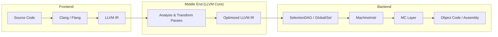

# LLVM Project — Architecture Overview

**Repository:** [llvm/llvm-project](https://github.com/llvm/llvm-project)
**Version studied:** 23.0.0git (main branch, shallow clone)
**Languages:** C++ (C++17 required), C, Assembly, TableGen, Python
**Build system:** CMake (minimum 3.20.0) with Ninja as the preferred generator
**License:** Apache License v2.0 with LLVM Exceptions

---

## What Is LLVM?

LLVM is a compiler infrastructure project — a collection of modular and reusable compiler and toolchain technologies. It is **not** a single compiler; it is a framework for building compilers, optimizers, JIT engines, linkers, debuggers, and related tools.

The name "LLVM" originally stood for "Low Level Virtual Machine," but this is no longer considered an acronym. The project has grown far beyond its original virtual-machine roots.

## The Monorepo

The `llvm-project` repository is a monorepo containing all major LLVM subprojects. At the top level:

```
llvm-project/
├── llvm/          # Core IR, optimizer, code generator, MC layer, tools
├── clang/         # C/C++/Objective-C frontend
├── clang-tools-extra/  # Extra Clang-based tools (clang-tidy, clangd, etc.)
├── lld/           # LLVM linker (ELF, COFF, Mach-O, WebAssembly)
├── lldb/          # LLVM debugger
├── mlir/          # Multi-Level Intermediate Representation
├── flang/         # Fortran frontend
├── flang-rt/      # Flang runtime library
├── bolt/          # Binary Optimization and Layout Tool
├── polly/         # Polyhedral loop optimizer
├── compiler-rt/   # Runtime libraries (sanitizers, builtins, profiling)
├── libcxx/        # C++ standard library (libc++)
├── libcxxabi/     # C++ ABI library
├── libunwind/     # Stack unwinding library
├── libsycl/       # SYCL runtime library
├── libclc/        # OpenCL C library
├── openmp/        # OpenMP runtime
├── orc-rt/        # ORC JIT runtime
├── offload/       # GPU/accelerator offloading support
├── cross-project-tests/  # Tests spanning multiple subprojects
├── cmake/         # Shared CMake modules
├── runtimes/      # Build infrastructure for runtime libraries
├── third-party/   # Third-party dependencies (benchmark, unittest)
└── utils/         # Shared utility scripts
```

## High-Level Architecture

LLVM's architecture follows a classic three-phase compiler design, but with clean separation at each boundary:



### Phase 1: Frontend (Clang, Flang, etc.)

Frontends parse source languages and produce **LLVM IR** (Intermediate Representation). Clang handles C, C++, Objective-C, and Objective-C++. Flang handles Fortran. Third-party frontends exist for Rust (rustc), Swift, Julia, and many others.

The key design principle: **frontends are independent of backends**. A frontend only needs to produce valid LLVM IR; it doesn't need to know anything about the target machine.

### Phase 2: Middle End (The Optimizer)

The LLVM optimizer operates on LLVM IR through a pipeline of **analysis and transformation passes**. These passes are target-independent and operate at multiple levels:

- **Module passes** — operate on the entire module (e.g., interprocedural optimizations, dead global elimination)
- **CGSCC passes** — operate on call graph strongly connected components (e.g., inlining)
- **Function passes** — operate on individual functions (e.g., SROA, GVN, loop optimizations)
- **Loop passes** — operate on individual loops within functions

The pass pipeline is managed by the **New Pass Manager** (`PassBuilder`), which constructs optimization pipelines for different optimization levels (O0 through O3, Os, Oz).

Key analyses include:
- **Alias Analysis** — determines whether memory accesses may alias
- **Dominator Trees** — control flow dominance relationships
- **Loop Info** — natural loop detection and nesting structure
- **Scalar Evolution (SCEV)** — symbolic analysis of scalar expressions
- **MemorySSA** — SSA form for memory operations

Key transformations include:
- **SROA** (Scalar Replacement of Aggregates) — decomposes allocas into SSA values
- **InstCombine** — peephole algebraic simplification
- **GVN** (Global Value Numbering) — redundancy elimination
- **Loop Vectorizer** — auto-vectorization of loops
- **Inliner** — function inlining based on cost modeling

### Phase 3: Backend (Code Generation)

The backend lowers optimized LLVM IR to machine code through several stages:

1. **Instruction Selection** — LLVM IR → SelectionDAG → MachineInstr (two approaches: SelectionDAG and the newer GlobalISel)
2. **Register Allocation** — virtual registers → physical registers
3. **Instruction Scheduling** — reorder instructions for the target microarchitecture
4. **MC Layer** — MachineInstr → MCInst → binary encoding or assembly text

LLVM supports 30+ target architectures including:
AArch64, AMDGPU, ARC, ARM, AVR, BPF, CSKY, DirectX, Hexagon, Lanai, LoongArch, M68k, Mips, MSP430, NVPTX, PowerPC, RISCV, Sparc, SPIRV, SystemZ, VE, WebAssembly, X86, XCore, Xtensa

Each target backend is defined largely through **TableGen** (`.td` files) — a domain-specific language that describes instruction sets, register files, calling conventions, and scheduling models. TableGen generates C++ code from these declarative descriptions.

## The LLVM IR

LLVM IR is the central abstraction of the entire project. It is:

- **Typed** — every value has a type (integers of arbitrary width, floats, pointers, vectors, structs, arrays, functions)
- **SSA-based** — every value is defined exactly once and dominates all its uses (except for phi nodes at control flow join points)
- **Target-independent** — no target-specific information in the IR (that's the backend's job)
- **Three representations** — in-memory C++ objects, human-readable textual assembly (`.ll` files), and compact binary bitcode (`.bc` files)

The core IR class hierarchy:

```
Value (base of everything with a use-def chain)
├── Argument
├── BasicBlock
├── MetadataAsValue
├── InlineAsm
├── User (values that reference other values)
│   ├── Constant
│   │   ├── GlobalValue (GlobalVariable, Function, GlobalAlias, GlobalIFunc)
│   │   ├── ConstantInt, ConstantFP, ConstantArray, ...
│   │   └── ConstantExpr
│   ├── Instruction (the actual SSA operations)
│   │   ├── BinaryOperator
│   │   ├── LoadInst, StoreInst
│   │   ├── BranchInst, SwitchInst, ReturnInst
│   │   ├── CallInst, InvokeInst
│   │   ├── GetElementPtrInst
│   │   ├── PHINode
│   │   └── ... (60+ instruction types)
│   └── Operator
└── ...
```

- **Module** — the top-level container, holds global variables, functions, type definitions, and metadata
- **Function** — a callable unit, contains a list of BasicBlocks and Arguments
- **BasicBlock** — a straight-line sequence of Instructions ending in a terminator
- **Instruction** — a single SSA operation

## The LLVM RTTI System

LLVM uses a custom RTTI system instead of C++ `dynamic_cast`. The functions `isa<>`, `cast<>`, `dyn_cast<>`, and `dyn_cast_or_null<>` (defined in `llvm/Support/Casting.h`) provide type checking and casting without virtual dispatch overhead. Each `Value` subclass has a `SubclassID` field used for classification.

## Key Data Structures (ADT)

LLVM provides its own collection of Abstract Data Types tuned for compiler workloads:

- **SmallVector** — vector with inline storage for small sizes, avoids heap allocation
- **StringRef** — non-owning reference to a string, avoids copies
- **ArrayRef** — non-owning reference to a contiguous array
- **DenseMap** — hash map optimized for small keys (pointers, integers)
- **BumpPtrAllocator** — arena allocator for fast allocation with bulk deallocation
- **ilist** — intrusive doubly-linked list (used for Instructions in BasicBlocks, BasicBlocks in Functions)
- **FoldingSet** — uniquing set using profile-based identity (used for IR constants and types)

## Scale

The LLVM core (`llvm/` directory alone) contains:
- ~7,700 C++ source/header files
- ~209,000 lines of C++ implementation code (`.cpp` files in `lib/`)
- 258 files in `lib/CodeGen/` alone
- 127 analysis passes in `lib/Analysis/`
- 82 scalar transformation passes in `lib/Transforms/Scalar/`
- 30+ target backends in `lib/Target/`

## Design Philosophy

1. **Modularity** — Each component (analysis, transform, target) is a separate library. You can link only what you need.
2. **Reusability** — The same IR, analyses, and code generation infrastructure serve all source languages and target architectures.
3. **Predictability** — The pass manager provides well-defined ordering and dependency management. Analyses are computed lazily and cached.
4. **Extensibility** — Adding a new optimization pass, analysis, or target backend follows well-established patterns using TableGen and the pass registration infrastructure.
5. **Testing** — Extensive use of `FileCheck`-based lit tests (input IR → run tool → check output patterns). Unit tests via Google Test.
