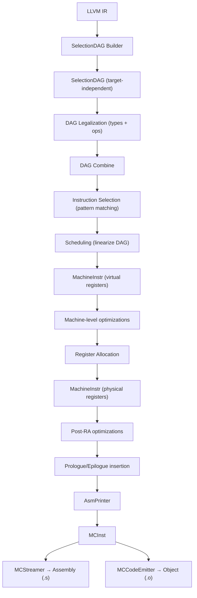

# Deep Dive: LLVM Code Generation Pipeline

The code generation subsystem (backend) is responsible for lowering target-independent LLVM IR into target-specific machine code. This is the most complex part of LLVM, involving multiple intermediate representations and dozens of passes.

---

## Overview of the Pipeline



---

## SelectionDAG-Based Instruction Selection

The dominant instruction selection framework. Operates one basic block at a time.

### Phase 1: IR → SelectionDAG

`SelectionDAGBuilder` (`lib/CodeGen/SelectionDAG/SelectionDAGBuilder.cpp`) translates LLVM IR instructions into SelectionDAG nodes.

Each DAG node (`SDNode`, defined in `include/llvm/CodeGen/SelectionDAGNodes.h`) represents an operation:
- **Opcode** — `ISD::ADD`, `ISD::LOAD`, `ISD::STORE`, `ISD::CALL`, etc.
- **Value types** — each result has a machine value type (`MVT::i32`, `MVT::f64`, `MVT::v4f32`)
- **Operands** — `SDValue` references to other nodes (value + result number)
- **Chain edges** — enforce memory operation ordering

```
Example: int a = b + c;

           [EntryToken]
                │ chain
          [Load b] ──── [Load c]
                │           │
             [ADD] ─────────┘
                │
          [Store result]
```

### Phase 2: Type Legalization

Many operations in the initial DAG use types the target doesn't natively support. The type legalizer (`lib/CodeGen/SelectionDAG/LegalizeTypes.cpp`) handles this:

- **Promotion** — `i8 add` → `i32 add` (on targets without 8-bit arithmetic)
- **Expansion** — `i64 add` → two `i32 add` + carry (on 32-bit targets)
- **Scalarization** — `v4f32 add` → four `f32 add` (if vector type unsupported)
- **Widening** — `v3f32` → `v4f32` (pad to power-of-two)

### Phase 3: Operation Legalization

After type legalization, the DAG combiner runs, then operation legalization (`lib/CodeGen/SelectionDAG/LegalizeDAG.cpp`) handles operations the target doesn't support:

- **Expansion** — `SDIV` → library call to `__divsi3`
- **Custom** — target provides a custom lowering in `TargetLowering::LowerOperation()`
- **Promotion** — use a wider operation

The target declares legality in its `TargetLowering` subclass:
```cpp
setOperationAction(ISD::SDIV, MVT::i32, Expand);  // Use libcall
setOperationAction(ISD::FSIN, MVT::f64, Custom);   // Custom lowering
```

### Phase 4: Instruction Selection

Pattern matching transforms target-independent DAG nodes into target-specific ones.

Most patterns are defined in `.td` (TableGen) files:
```tablegen
// X86InstrArithmetic.td (simplified)
def ADD32rr : I<0x01, MRMDestReg,
    (outs GR32:$dst), (ins GR32:$src1, GR32:$src2),
    "add{l}\t{$src2, $dst|$dst, $src2}",
    [(set GR32:$dst, EFLAGS,
          (X86add_flag GR32:$src1, GR32:$src2))]>;
```

The `TableGen` tool generates a C++ matching function from these patterns. The generated matcher walks the DAG and applies the best-matching pattern for each node.

**Files:**
- `lib/CodeGen/SelectionDAG/SelectionDAGISel.cpp` — main selection loop
- `lib/Target/X86/X86ISelDAGToDAG.cpp` — X86-specific custom selection

### Phase 5: Scheduling

After selection, the DAG is linearized into a sequence of `MachineInstr` instructions. The scheduler considers:
- Data dependencies
- Register pressure
- Target-specific latencies and resources

**File:** `lib/CodeGen/SelectionDAG/ScheduleDAGSDNodes.cpp`

---

## GlobalISel (The Newer Alternative)

GlobalISel operates directly on `MachineInstr` without an intermediate DAG. It processes the entire function at once (not basic-block-at-a-time).

### Pipeline

```
LLVM IR
    ↓ IRTranslator
Generic MachineInstr (target-independent opcodes like G_ADD, G_LOAD)
    ↓ Legalizer
Legal Generic MachineInstr (types and ops are legal for the target)
    ↓ RegBankSelect
MachineInstr with register bank assignments
    ↓ InstructionSelect
Target-specific MachineInstr
```

### Key components:
- **IRTranslator** (`lib/CodeGen/GlobalISel/IRTranslator.cpp`) — translates IR to generic MI
- **Legalizer** (`lib/CodeGen/GlobalISel/Legalizer.cpp`) — makes types/ops legal
- **RegBankSelect** (`lib/CodeGen/GlobalISel/RegBankSelect.cpp`) — assigns register banks
- **InstructionSelect** (`lib/CodeGen/GlobalISel/InstructionSelect.cpp`) — selects target instructions

GlobalISel advantages:
- Faster compile time (no DAG construction/destruction)
- Better optimization opportunities (cross-basic-block view)
- More maintainable code (clearer abstractions)

GlobalISel is the default for AArch64 at `-O0` and is being extended to higher optimization levels and more targets.

---

## MachineInstr — The Machine-Level IR

After instruction selection, code is in `MachineInstr` form:

### MachineFunction (`include/llvm/CodeGen/MachineFunction.h`)
Contains `MachineBasicBlock`s, the stack frame layout, constant pool, and jump tables.

### MachineBasicBlock (`include/llvm/CodeGen/MachineBasicBlock.h`)
An `ilist` of `MachineInstr`. Tracks predecessor/successor blocks, live-in registers, and alignment.

### MachineInstr (`include/llvm/CodeGen/MachineInstr.h`)
A target-specific instruction with:
- **Opcode** — target-specific (e.g., `X86::ADD32rr`)
- **Operands** — `MachineOperand` objects (registers, immediates, frame indices, global addresses, etc.)
- **Flags** — `isCall`, `isBranch`, `isTerminator`, `mayLoad`, `mayStore`, `hasUnmodeledSideEffects`
- **MemOperands** — memory access descriptors for alias analysis

### MachineOperand
Different from LLVM IR operands. Types include:
- `MO_Register` — physical or virtual register
- `MO_Immediate` — immediate constant
- `MO_FrameIndex` — reference to a stack slot
- `MO_GlobalAddress` — reference to a global symbol
- `MO_MachineBasicBlock` — branch target

---

## Register Allocation

Maps virtual registers to physical machine registers.

### Algorithms

| Algorithm | Flag | Use case |
|-----------|------|----------|
| Greedy | (default) | Production optimization levels |
| Basic | `-regalloc=basic` | Simple linear scan |
| Fast | `-regalloc=fast` | -O0 (fastest compilation) |
| PBQP | `-regalloc=pbqp` | Partitioned Boolean Quadratic Programming |

### Greedy Allocator (`lib/CodeGen/RegAllocGreedy.cpp`)

The default allocator. Key steps:
1. Compute **live intervals** for each virtual register
2. Order virtual registers by **priority** (spill weight)
3. For each virtual register, try to find a physical register
4. If no register available, consider **evicting** a lower-priority register
5. If eviction fails, **split** the live range into smaller pieces
6. If splitting fails, **spill** to the stack

### Spilling

When a virtual register can't fit in a physical register, the allocator inserts loads and stores to move the value between the stack and registers:
- **Spill** — store register to stack slot
- **Reload** — load from stack slot to register
- **Rematerialization** — recompute the value instead of loading it (cheaper for constants)

---

## The MC Layer

The Machine Code layer is the bottom of the stack. It handles:
- **Instruction encoding** — turning MCInst into bytes
- **Assembly emission** — turning MCInst into assembly text
- **Assembly parsing** — turning assembly text into MCInst
- **Object file emission** — writing ELF, COFF, Mach-O, Wasm files
- **Disassembly** — turning bytes into MCInst

### MCInst (`include/llvm/MC/MCInst.h`)

The lightest instruction representation:
```cpp
class MCInst {
  unsigned Opcode = 0;
  SmallVector<MCOperand, 8> Operands;
  SMLoc Loc;  // Source location for diagnostics
};
```

No virtual registers, no SSA, no use-def chains. Just opcodes and operands.

### MCStreamer (`include/llvm/MC/MCStreamer.h`)

The abstraction for emitting machine code. Two main implementations:
- `MCAsmStreamer` — emits assembly text
- `MCObjectStreamer` (subclasses: `MCELFStreamer`, `MCMachOStreamer`, `MCWinCOFFStreamer`) — emits object files

The `AsmPrinter` (`lib/CodeGen/AsmPrinter/AsmPrinter.cpp`) translates `MachineInstr` to `MCInst` and feeds them to the streamer.

---

## Target Description (TableGen)

Each backend is largely defined through `.td` files:

```
lib/Target/X86/
├── X86.td                    # Main target description
├── X86RegisterInfo.td        # Register definitions
├── X86InstrInfo.td           # Instruction definitions (includes sub-files)
├── X86InstrArithmetic.td     # Arithmetic instructions
├── X86InstrSSE.td            # SSE/AVX instructions
├── X86CallingConv.td         # Calling conventions
├── X86Schedule*.td           # Scheduling models per microarchitecture
└── ...
```

TableGen generates:
- **Instruction descriptions** — `X86GenInstrInfo.inc`
- **Register descriptions** — `X86GenRegisterInfo.inc`
- **Instruction selection patterns** — `X86GenDAGISel.inc`
- **Assembly printer** — `X86GenAsmWriter.inc`
- **Assembly parser** — `X86GenAsmMatcher.inc`
- **Disassembler tables** — `X86GenDisassemblerTables.inc`
- **Subtarget features** — `X86GenSubtargetInfo.inc`

---

## Target Registration

Targets register themselves using a plugin-like mechanism:

```cpp
// lib/Target/X86/X86TargetMachine.cpp
extern "C" LLVM_EXTERNAL_VISIBILITY void LLVMInitializeX86Target() {
  RegisterTargetMachine<X86TargetMachine> X(getTheX86_32Target());
  RegisterTargetMachine<X86TargetMachine> Y(getTheX86_64Target());
}
```

The `LLVM_TARGETS_TO_BUILD` CMake variable controls which targets are compiled and linked. At startup, `InitializeAllTargets()` calls each target's initialization function.

**Files:**
- `include/llvm/Target/TargetMachine.h` — abstract target interface
- `include/llvm/MC/TargetRegistry.h` — target registration infrastructure
